# 🦷 Dental Voice AI - FAQ Processor

[](https://python.org)
[](https://fastapi.tiangolo.com)
[](https://vapi.ai)
[](https://supabase.com)
[](#)

> **Production-ready AI-powered voice assistant for dental practices with intelligent FAQ matching, real-time intent recognition, and seamless VAPI integration.**

## 🎯 Overview

The Dental Voice AI system provides intelligent voice assistance for dental practices, featuring:

- **🧠 Advanced FAQ Matching** - Semantic similarity with 70%+ accuracy
- **🎯 Real-time Intent Recognition** - 12 dental-specific intent types
- **🏥 Multi-Practice Support** - Scalable architecture for multiple practices
- **📞 VAPI Integration** - Seamless voice AI platform connectivity
- **📊 Comprehensive Analytics** - Call logging and performance monitoring
- **🔒 Production Security** - Enterprise-grade error handling and validation

## 📊 System Architecture & Flow Diagrams

### 🔄 End-to-End Call Flow

```mermaid
flowchart TD
    A["👤 Patient Initiates Call"] --> B["📞 Dials Dental Office Number"]
    B --> C["🔊 VAPI Voice AI Answers"]
    C --> D["🎤 Patient Speaks Question"]
    D --> E["📝 Speech-to-Text Conversion"]
    E --> F["🔧 VAPI Triggers Function Call"]
    F --> G["🌐 HTTP POST to Backend Webhook"]
    G --> H["⚡ FastAPI Receives Request"]
    H --> I["🔍 Extract Call Data & Transcript"]
    I --> J["🏥 Identify Dental Practice"]
    J --> K["📊 Query Practice Data from Supabase"]
    K --> L["🧠 AI FAQ Matcher Analysis"]
    L --> M{"🎯 FAQ Match Found?"}
    M -->|"✅ Yes (>70% confidence)"| N["💬 Return Practice-Specific Answer"]
    M -->|"❌ No"| O["🔍 General Intent Recognition"]
    O --> P["📋 Extract Entities (dates, services, etc.)"]
    P --> Q["💭 Generate Personalized Response"]
    N --> R["📝 Log Call Data to Database"]
    Q --> R
    R --> S["📤 Return JSON Response to VAPI"]
    S --> T["🗣️ Text-to-Speech Conversion"]
    T --> U["🔊 AI Speaks Answer to Patient"]
    U --> V["📞 Call Continues or Ends"]
    
    style A fill:#e1f5fe,stroke:#01579b,stroke-width:2px
    style C fill:#f3e5f5,stroke:#4a148c,stroke-width:2px
    style L fill:#fff8e1,stroke:#f57f17,stroke-width:2px
    style M fill:#fce4ec,stroke:#c2185b,stroke-width:2px
    style S fill:#e8f5e8,stroke:#2e7d32,stroke-width:2px
```



### 🧠 AI Processing Pipeline

```mermaid
flowchart LR
    subgraph "🧠 AI Processing Pipeline"
        A["📝 Raw Transcript<br/>'What are your Friday hours?'"] --> B["🔧 Text Normalization<br/>• Remove punctuation<br/>• Lowercase conversion<br/>• Common abbreviations"]
        B --> C["🏥 Practice Identification<br/>• Phone number lookup<br/>• Assistant ID mapping<br/>• Metadata extraction"]
        C --> D["📊 Database Query<br/>• Fetch practice FAQs<br/>• Get configuration<br/>• Load services/hours"]
        D --> E["🎯 Multi-Stage FAQ Matching"]
        
        subgraph E["🎯 Multi-Stage FAQ Matching"]
            E1["🔤 Exact Match<br/>Threshold: 100%"]
            E2["📝 Substring Match<br/>Threshold: 85%"]
            E3["🏷️ Keyword Overlap<br/>Threshold: 75%"]
            E4["🧠 Semantic Similarity<br/>Threshold: 70%"]
            
            E1 --> E2
            E2 --> E3
            E3 --> E4
        end
        
        E --> F{"📈 Confidence Score"}
        F -->|"≥70%"| G["✅ FAQ Response Found<br/>Return practice-specific answer"]
        F -->|"<70%"| H["🔍 General Intent Recognition"]
        
        H --> I["📋 Entity Extraction<br/>• Times: '2:30 PM'<br/>• Days: 'Friday'<br/>• Services: 'cleaning'"]
        I --> J["💭 Response Generation<br/>• Practice-specific data<br/>• Personalized context<br/>• Entity enhancement"]
        
        G --> K["📝 Call Logging<br/>• Store in database<br/>• Track confidence<br/>• Record response"]
        J --> K
        K --> L["📤 JSON Response<br/>Return to VAPI"]
    end
    
    style A fill:#e1f5fe,stroke:#01579b
    style E fill:#fff8e1,stroke:#f57f17
    style F fill:#fce4ec,stroke:#c2185b
    style G fill:#e8f5e8,stroke:#2e7d32
    style L fill:#f3e5f5,stroke:#7b1fa2
```



## 🏗️ Technical Architecture Diagrams

### 📐 UML Class Diagram


### 🔄 Sequence Diagram

```mermaid
sequenceDiagram
    participant P as 👤 Patient
    participant V as 📞 VAPI Platform
    participant N as 🌐 ngrok Tunnel
    participant F as ⚡ FastAPI Backend
    participant A as 🧠 AI FAQ Matcher
    participant D as 📊 Supabase Database
    
    P->>V: 1. Dials dental office number
    V->>P: 2. Answers call with greeting
    P->>V: 3. Asks question (voice)
    V->>V: 4. Speech-to-text conversion
    V->>N: 5. POST /dental/incoming_call
    N->>F: 6. Forward webhook request
    F->>F: 7. Extract call data & transcript
    F->>D: 8. Query practice configuration
    D-->>F: 9. Return practice data & FAQs
    F->>A: 10. Analyze transcript for intent
    A->>A: 11. Normalize text & match FAQs
    A-->>F: 12. Return intent analysis result
    F->>D: 13. Log call data & response
    D-->>F: 14. Confirm data logged
    F-->>N: 15. Return JSON response
    N-->>V: 16. Forward response to VAPI
    V->>V: 17. Text-to-speech conversion
    V->>P: 18. Speak AI-generated response
    
    Note over P,D: End-to-End Response Time: ~500-1000ms
    
    rect rgb(255, 248, 225)
        Note over V,A: Real-time AI Processing
    end
    
    rect rgb(232, 245, 232)
        Note over F,D: Database Operations
    end
```



### 🔄 State Diagram


### 🗂️ Communication Diagram


### 🌐 Deployment Diagram

```mermaid
graph TB
    subgraph "☁️ Cloud Infrastructure"
        subgraph "🌐 VAPI Cloud"
            V[VAPI Voice AI Platform<br/>📞 Speech Processing<br/>🔊 TTS/STT Engine]
        end
        
        subgraph "🗄️ Supabase Cloud"
            DB[(Supabase PostgreSQL<br/>📊 Practice Data<br/>📝 Call Logs<br/>🔍 Indexed Queries)]
        end
        
        subgraph "🔗 Tunneling Service"
            N[ngrok Service<br/>🌍 Public HTTPS Endpoint<br/>🔒 Secure Tunneling]
        end
    end
    
    subgraph "💻 Local Development Environment"
        subgraph "🐍 Python Runtime"
            APP[FastAPI Application<br/>⚡ Uvicorn Server<br/>🔧 Port 8000]
        end
        
        subgraph "📁 Project Files"
            SRC[Source Code<br/>🧠 AI FAQ Matcher<br/>📡 Webhook Handlers<br/>📋 Data Schemas]
        end
        
        subgraph "⚙️ Dependencies"
            DEPS[Python Packages<br/>📦 FastAPI + Uvicorn<br/>🗄️ Supabase Client<br/>✅ Pydantic Validation]
        end
    end
    
    subgraph "📱 User Interface"
        PHONE[📞 Patient Phone<br/>🎤 Voice Input<br/>🔊 Audio Output]
    end
    
    %% Connections
    PHONE <-->|"📞 Voice Call"| V
    V <-->|"🌐 HTTPS Webhook"| N
    N <-->|"🔗 Tunnel"| APP
    APP <-->|"📊 Database Queries"| DB
    APP --> SRC
    APP --> DEPS
    
    %% Environment Labels
    V -.->|"Production Ready"| V
    DB -.->|"Cloud Database"| DB
    APP -.->|"Local Development"| APP
    
    style V fill:#f3e5f5,stroke:#7b1fa2,stroke-width:2px
    style DB fill:#e8f5e8,stroke:#2e7d32,stroke-width:2px
    style APP fill:#e3f2fd,stroke:#1976d2,stroke-width:2px
    style N fill:#fff3e0,stroke:#f57c00,stroke-width:2px
    style PHONE fill:#fce4ec,stroke:#c2185b,stroke-width:2px
```



## 📊 Database Schema


## 🚀 Quick Start

### Prerequisites
- Python 3.9+
- Supabase account and project
- VAPI account (optional, for voice integration)
- ngrok (for webhook tunneling)

### 1. Installation

```bash
# Clone the repository
git clone <repository-url>
cd dental-voice-ai/backend

# Create virtual environment
python -m venv venv
source venv/bin/activate  # On Windows: venv\Scripts\activate

# Install dependencies
pip install -r requirements.txt
```

### 2. Environment Configuration

Create a `.env` file:

```env
# Required - Database Configuration
SUPABASE_URL=your_supabase_project_url
SUPABASE_KEY=your_supabase_anon_key

# Optional - Application Settings
ENVIRONMENT=development
DEBUG=true
LOG_LEVEL=INFO

# Optional - VAPI Integration
VAPI_API_KEY=your_vapi_api_key
WEBHOOK_SECRET=your_webhook_secret

# Optional - AI Configuration
FAQ_SIMILARITY_THRESHOLD=0.7
INTENT_CONFIDENCE_THRESHOLD=0.3
```

### 3. Database Setup

Run in Supabase SQL Editor:

```sql
-- Create tenants table
CREATE TABLE tenants (
    id UUID PRIMARY KEY DEFAULT gen_random_uuid(),
    name TEXT NOT NULL,
    phone_number TEXT UNIQUE,
    hours_json JSONB,
    insurances_json JSONB,
    faq_json JSONB,
    services_json JSONB,
    location_json JSONB,
    created_at TIMESTAMP WITH TIME ZONE DEFAULT NOW()
);

-- Create calls table
CREATE TABLE calls (
    id UUID PRIMARY KEY DEFAULT gen_random_uuid(),
    tenant_id UUID REFERENCES tenants(id),
    caller_number TEXT NOT NULL,
    status TEXT NOT NULL,
    transcript TEXT,
    intent TEXT,
    intent_confidence DECIMAL(3,2),
    faq_matched TEXT,
    response_text TEXT,
    created_at TIMESTAMP WITH TIME ZONE DEFAULT NOW()
);

-- Create performance indexes
CREATE INDEX idx_tenants_phone_number ON tenants(phone_number);
CREATE INDEX idx_calls_tenant_id ON calls(tenant_id);
CREATE INDEX idx_calls_created_at ON calls(created_at);
```

### 4. Start the Application

```bash
# Development server
uvicorn app.main:app --reload --host 0.0.0.0 --port 8000

# Production server (optional)
# gunicorn app.main:app -w 4 -k uvicorn.workers.UvicornWorker --bind 0.0.0.0:8000
```

### 5. Webhook Setup

```bash
# Install ngrok (if not already installed)
# https://ngrok.com/download

# Create tunnel
ngrok http 8000

# Use the HTTPS URL for VAPI webhook configuration
# Example: https://abc123.ngrok-free.app/dental/incoming_call
```

## 📡 API Documentation

### Health Check Endpoints

| Endpoint | Method | Description |
|----------|--------|-------------|
| `/` | GET | Basic service status |
| `/health` | GET | Comprehensive health check |
| `/docs` | GET | Interactive API documentation (dev only) |

### Webhook Endpoints

| Endpoint | Method | Description |
|----------|--------|-------------|
| `/dental/incoming_call` | POST | VAPI webhook handler |
| `/dental/analyze_intent` | POST | Standalone intent analysis |

### Example Webhook Response

```json
{
  "results": [
    {
      "toolCallId": "call_123",
      "result": "Our office hours on Friday are 9 AM to 5 PM. Would you like to schedule an appointment?"
    }
  ]
}
```

## 🎯 Intent Recognition

### Supported Intents

| Intent | Keywords | Example |
|--------|----------|---------|
| `appointment_booking` | schedule, book, appointment | "I'd like to schedule a cleaning" |
| `appointment_cancel` | cancel, can't make it | "I need to cancel my appointment" |
| `hours_inquiry` | hours, open, operating hours | "What are your Friday hours?" |
| `insurance_inquiry` | insurance, coverage, accept | "Do you accept Delta insurance?" |
| `services_inquiry` | services, treatment, cleaning | "What services do you offer?" |
| `location_inquiry` | location, address, directions | "Where are you located?" |
| `emergency` | pain, emergency, urgent | "I have severe tooth pain" |
| `payment_inquiry` | cost, price, payment plans | "How much does a cleaning cost?" |

### Entity Extraction

- **Time**: "2:30 PM", "morning", "afternoon"
- **Day**: "Monday", "today", "tomorrow"
- **Date**: "March 15th", "3/15/2024"
- **Insurance**: "Delta", "Aetna", "Blue Cross"
- **Services**: "cleaning", "filling", "crown"
- **Pain Level**: "severe", "mild", "moderate"

## 🏥 Multi-Practice Configuration

### Practice Data Structure

```json
{
  "name": "Bright Smiles Dental",
  "phone_number": "+1234567890",
  "hours_json": {
    "mon": ["9:00 AM - 5:00 PM"],
    "tue": ["9:00 AM - 5:00 PM"],
    "wed": ["9:00 AM - 5:00 PM"],
    "thu": ["9:00 AM - 5:00 PM"],
    "fri": ["9:00 AM - 3:00 PM"]
  },
  "insurances_json": ["Delta", "Aetna", "Blue Cross"],
  "faq_json": {
    "What are your hours on Friday?": "We're open Friday 9 AM to 3 PM.",
    "Do you accept walk-ins?": "We accept walk-ins based on availability."
  },
  "services_json": ["Cleanings", "Fillings", "Crowns", "Root Canals"],
  "location_json": {
    "address": "123 Main St, City, State 12345",
    "parking": "Free parking available"
  }
}
```

## 🔧 VAPI Integration

### Function Tool Configuration

**Tool Name**: `get_dental_info`
**Description**: Get dental practice information and FAQ responses
**Server URL**: `https://your-ngrok-url.ngrok-free.app/dental/incoming_call`

**Parameters Schema**:
```json
{
  "type": "object",
  "properties": {
    "query": {
      "type": "string",
      "description": "The patient's question or request about the dental practice"
    },
    "phone_number": {
      "type": "string", 
      "description": "The dental practice phone number being called"
    },
    "caller_number": {
      "type": "string",
      "description": "The patient's phone number"
    }
  },
  "required": ["query"]
}
```

### Assistant Instructions

```
You are a helpful dental office assistant for [Practice Name]. When users ask about:
- Office hours
- Services offered  
- Insurance information
- Location details
- Any other practice-specific questions

You MUST use the get_dental_info function to retrieve accurate, up-to-date information from our practice database. Always call this function before responding to these types of questions.
```

## 🔒 Production Deployment

### Environment Variables

```env
# Production Configuration
ENVIRONMENT=production
DEBUG=false
LOG_LEVEL=WARNING

# Security
WEBHOOK_SECRET=your_secure_webhook_secret

# Performance
DB_POOL_SIZE=20
DB_MAX_OVERFLOW=40
REQUEST_TIMEOUT=30

# CORS (if needed)
CORS_ORIGINS=["https://yourdomain.com"]
```

### Docker Deployment (Optional)

```dockerfile
FROM python:3.9-slim

WORKDIR /app
COPY requirements.txt .
RUN pip install --no-cache-dir -r requirements.txt

COPY . .
EXPOSE 8000

CMD ["uvicorn", "app.main:app", "--host", "0.0.0.0", "--port", "8000"]
```

### Performance Monitoring

```bash
# Install production dependencies
pip install gunicorn prometheus-client structlog

# Start with monitoring
gunicorn app.main:app \
  -w 4 \
  -k uvicorn.workers.UvicornWorker \
  --bind 0.0.0.0:8000 \
  --access-logfile - \
  --error-logfile -
```

## 📈 Analytics & Monitoring

### Key Metrics

- **Response Accuracy**: FAQ match confidence scores
- **Intent Recognition**: Intent classification accuracy  
- **Response Time**: End-to-end processing latency
- **Error Rates**: Failed webhook calls and database errors
- **Usage Patterns**: Call volume by practice and time

### Database Queries

```sql
-- Call volume by practice
SELECT t.name, COUNT(c.id) as call_count
FROM tenants t
LEFT JOIN calls c ON t.id = c.tenant_id
GROUP BY t.name;

-- Average confidence by intent
SELECT intent, AVG(intent_confidence) as avg_confidence
FROM calls 
WHERE intent_confidence IS NOT NULL
GROUP BY intent;

-- Recent FAQ matches
SELECT faq_matched, COUNT(*) as match_count
FROM calls 
WHERE faq_matched IS NOT NULL
AND created_at > NOW() - INTERVAL '7 days'
GROUP BY faq_matched
ORDER BY match_count DESC;
```

## 🛠️ Development

### Code Quality

```bash
# Install development dependencies
pip install pytest black flake8 isort

# Format code
black app/
isort app/

# Lint code
flake8 app/

# Run tests
pytest tests/
```

### Project Structure

```
backend/
├── app/
│   ├── main.py                          # FastAPI application
│   ├── webhooks/
│   │   └── dental_webhook_handler.py    # VAPI webhook processor
│   ├── ai_processing/
│   │   └── dental_faq_matcher.py        # FAQ matching & intent recognition
│   ├── database/
│   │   ├── config.py                    # Configuration settings
│   │   └── database_operations.py       # Supabase client & operations
│   └── models/
│       └── webhook_schemas.py           # Pydantic schemas
├── requirements.txt                     # Python dependencies
└── README.md                           # This file
```

## 🤝 Contributing

1. Fork the repository
2. Create a feature branch (`git checkout -b feature/amazing-feature`)
3. Commit your changes (`git commit -m 'Add amazing feature'`)
4. Push to the branch (`git push origin feature/amazing-feature`)
5. Open a Pull Request

## 📄 License

This project is licensed under the MIT License - see the [LICENSE](LICENSE) file for details.

## 🆘 Support

For support and questions:

- 📧 Email: support@dentalvoiceai.com
- 📚 Documentation: [docs.dentalvoiceai.com](https://docs.dentalvoiceai.com)
- 🐛 Issues: [GitHub Issues](https://github.com/your-org/dental-voice-ai/issues)

---

**Built with ❤️ for dental practices worldwide** 🦷✨